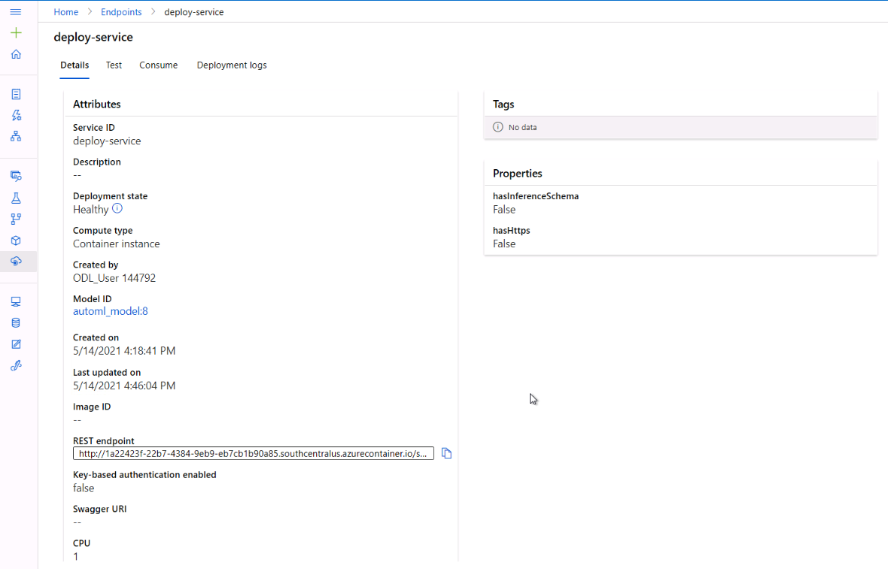

# Machine Learning with Azure: Capstone Projekt

This project is the final part of Udacitys Azure ML Nanodegree. In this project, I had the opportunity to apply the learned knowledge and demonstrate my ability to use an external dataset, train a model using the different tools available in the AzureML framework as well as my ability to deploy the model as a web service.

## Overview
In this project, I created two machine learning models: one using Azure Automated ML and one customized model whose hyperparameters are tuned using HyperDrive. I compared the performance of both the models and deployed the best performing model. 
The following diagram depicts the tasks involved: 

## Dataset

### Overview
For this project, I used a dataset from Kaggle's [Customer Churn Prediction 2020](https://www.kaggle.com/c/customer-churn-prediction-2020) competetion. 
The training dataset contains 4250 samples. Each sample contains 19 features and 1 boolean variable "churn" which indicates the class of the sample. 

### Task
This competition is about predicting whether a customer will change telecommunications provider, something known as "churning".
The 19 input features and 1 target variable are:

- "state", string. 2-letter code of the US state of customer residence
- "account_length", numerical. Number of months the customer has been with the current telco provider
- "area_code", string="area_code_AAA" where AAA = 3 digit area code.
- "international_plan", yes/no. The customer has international plan.
- "voice_mail_plan", yes/no. The customer has voice mail plan.
- "number_vmail_messages", numerical. Number of voice-mail messages.
- "total_day_minutes", numerical. Total minutes of day calls.
- "total_day_calls", numerical. Total minutes of day calls.
- "total_day_charge", numerical. Total charge of day calls.
- "total_eve_minutes", numerical. Total minutes of evening calls.
- "total_eve_calls", numerical. Total number of evening calls.
- "total_eve_charge", numerical. Total charge of evening calls.
- "total_night_minutes", numerical. Total minutes of night calls.
- "total_night_calls", numerical. Total number of night calls.
- "total_night_charge", numerical. Total charge of night calls.
- "total_intl_minutes", numerical. Total minutes of international calls.
- "total_intl_calls", numerical. Total number of international calls.
- "total_intl_charge", numerical. Total charge of international calls
- "number_customer_service_calls", numerical. Number of calls to customer service
- "churn", yes/no. Customer churn - target variable.

### Access
I uploaded the dataset into Azure ML and directly imported it from the workspace datasets. Another option was to use the [TabularDatasetFactory class](https://docs.microsoft.com/en-us/python/api/azureml-core/azureml.data.dataset_factory.tabulardatasetfactory?view=azure-ml-py#from-delimited-files-path--validate-true--include-path-false--infer-column-types-true--set-column-types-none--separator------header-true--partition-format-none--support-multi-line-false--empty-as-string-false--encoding--utf8--). 

## Automated ML
The task in hand is a classification problem. I will give a few details about the AutoML Configuration: 
The AutoML experiment will timeout after 20 minutes and uses a maximum of 5 concurrent iterations. It is, however, very possible to adjust those parameters (though a deep learning experiment has a limit of 24 hours). The primary metric is AUC_weighted (area under the curve weighted), which is the metric I want to optimize. The best-fit model will be chosen based on this metric. The binary classification predicts, whether a customer is going to leave the company or not (given in the lab column "churn"). Early stopping is enabled if the score is not improving in the short term.
The following screenshot shows the configurations used: 

### Results
After submitting the experiment with the given config, Azure AutoML not only tries several algorithms on the dataset, but also applies data guardrails. One interesting finding was that the dataset is highly imbalanced which can lead to a falsely perceived positive effect of a model's accuracy because the input data has bias towards one class. It might make sense to fix this beforehand to further improve the model's accuracy in the future.
After ca. 50 different models, the experiment timed out (can of course be prolonged to possibly get a better result) and the best model was built with a VotingEnsemble algorithm and an AUC_weighted of 92.5%. 

The parameters from the best run were: 

Other metrics for the best run: 

## Hyperparameter Tuning
To compare those results with a custom-coded model, I created a [train.py](./train.py) script. The hyperparameter tuning process should optimize the model afterwards. 
The necessary steps are: 
### 1. Define the parameter search space:

**Parameter sampler**
Tune hyperparameters by exploring the range of values defined for each hyperparameter.
I specified the parameter sampler as such:

    ps = RandomParameterSampling(
        {
            'C' : choice(0.001,0.01,0.1,1,10,20,50,100),
            'max_iter': choice(50, 75,100),"solver" : choice('liblinear', 'sag', 'lbfgs', 'saga')

        }
    )
I chose discrete values with choice for both parameters, C and max_iter.

*C* is the Regularization while *max_iter* is the maximum number of iterations. The *solver* is the algorithm to use in the optimization problem. 

Azure Machine Learning supports the following methods:
- Random sampling
- Grid sampling
- Bayesian sampling

I chose RandomParameterSampling because it is the fastest option and supports early termination of low-performance runs. In random sampling, hyperparameter values are randomly selected from the defined search space.

Further options are Grid sampling (Performs a simple grid search over all possible values) or Bayesian sampling (based on the Bayesian optimization algorithm, picks samples based on how previous samples performed, so that new samples improve the primary metric)
Both require enough budget to explore the hyperparameter space. 
###2. Specify a primary metric to optimize
Each training run is evaluated for the primary metric. The early termination policy uses the primary metric to identify low-performance runs.

The following attributes are needed for a primary metric:

- primary_metric_name: The name of the primary metric needs to exactly match the name of the metric logged by the training script
- primary_metric_goal: It can be either PrimaryMetricGoal.MAXIMIZE or PrimaryMetricGoal.MINIMIZE and determines whether the primary metric will be maximized or minimized when evaluating the runs.

In this case, I used the combination to maximize "accuracy". 
### 2. Specify early termination policy for low-performing runs
Automatically terminate poorly performing runs with an early termination policy. Early termination improves computational efficiency.Azure Machine Learning supports the following early termination policies:

- Bandit policy
- Median stopping policy
- Truncation selection policy
- No termination policy

I opted for the fastest version, the Bandit policy. Bandit policy is based on slack factor/slack amount and evaluation interval. Bandit terminates runs where the primary metric is not within the specified slack factor/slack amount compared to the best performing run. In other words, Azure ML should check the job every 2 iterations and if the primary metric falls outside the top 50% range, it should terminate the job (as seen in the following code snippet). 
    `policy = BanditPolicy(evaluation_interval=2, slack_factor=0.2)`
### 3. Specify ScriptConfig
Define the source_directory, state the script and allocate resources for the job. I added an environment to the config since my previous runs failed due to a missing dependency. 
I used a simple LogisticRegression for the binary classification task. 

### 4. Combine all in HyperDriveConfig
I defined a maximum of 10 runs and 5 concurrent runs. My primary metric (that I want to optimize for) is AUC_weighted, as for the AutoML run. 

### Results
I submitted the job with an AUC_weighted of roughly above 82%. 

The 10 runs couldn't result in a better model and the AUC_weighted stayed nearly the same. 

The best run with id HD_14476565-ccef-423f-87bd-35f019d3782d_8 had the following arguments: 'arguments': ['--C', '10', '--max_iter', '100', '--solver', 'liblinear'].

Using more iterations, we might have had a better result. Howver, I don't think that it would reach the level of AutoML. 

## Model Deployment
Thus it was clear that I will deploy the better performing AutoML VotingEnsemble model with >92% AUC_weighted and an accuracy >94%. 
For that, I used the model in pickle format (.pkl) and registered it as a model. I added a scoring.py script that initialized and runs my model. The idea is taken from an [Azure example](https://github.com/Azure/MachineLearningNotebooks/blob/master/how-to-use-azureml/deployment/deploy-to-cloud/model-register-and-deploy.ipynb). The endpoint is hosted on Azure Container Instances (ACI) and I used 1 CPU core with 1 GB memory. 
Endpoint is healthy: 
 
I did successfully test my endpoint as shown in the following screenshot: 
 

## Screen Recording
Please see everything in action using the following link: 
https://youtu.be/0lOsqToui3I 

## Standout Suggestions
- Leverage the model explanation feature: I was happy to see that Azure does provide an explanation on why a model was perfroming best in a stack of different AutoML models for a given problem. The tab "Explanation" gives interesting insight such as the performance of the model by the distribution of the prediction values as a box-whisker-plot
 or the feature importance.  We can see that the feature for 'Total minutes of day calls' is the most important one for the algorithm when classifying whether this datapoint is churning or not. 
- Enable ApllicationInsights: I wanted to see my model in production and enabled the application insights feature to see metrics such as server requests, the response time or failed requests. After successfully testing my endpoint (with a low number of total minutes of day calls :) ) 
I saw the metrics in Application Insights.
 

Thanks!